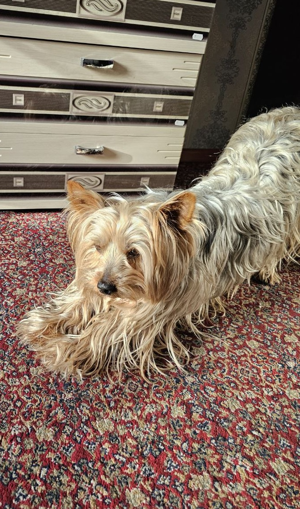
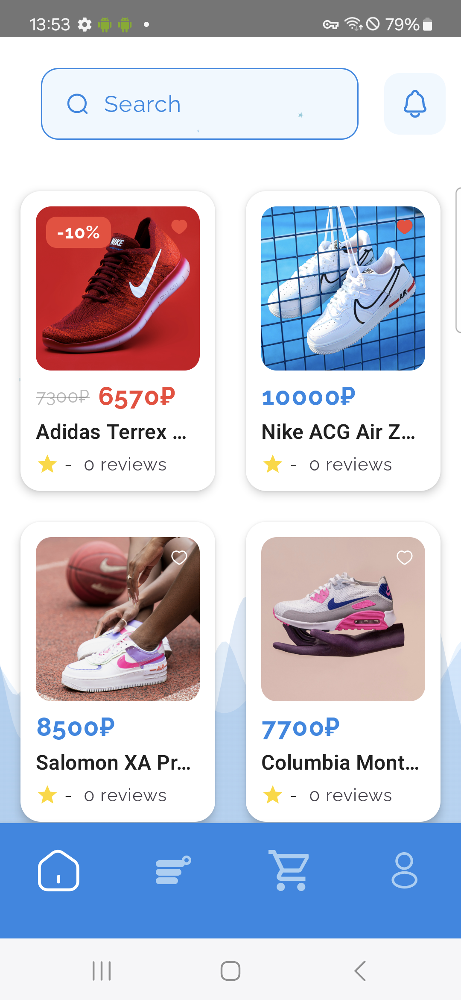
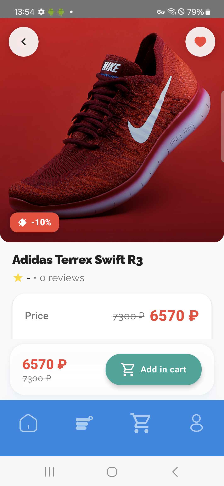
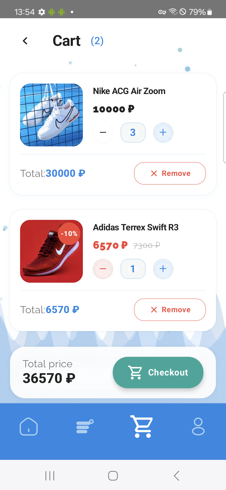

    
     
    
     
    

# 👋 Hello, I'm Roman!

    

I'm a 20-year-old developer from Tula, Russia, currently studying at Tula College of Construction and Industry Technologies. My passion lies in developing graphical applications for both desktop and mobile platforms, with a special interest in neural networks and computer vision.

## 🎯 About Me

- **Machine Learning & AI:** Developing systems that can learn and adapt to data. 🤖📈
- **Desktop & Mobile Apps:** Crafting seamless applications for desktop and mobile platforms. 📱🎨
- **Web Development:** Bringing ideas to life through dynamic and interactive online interfaces. 🌐💡
- **Computer Vision:** Enabling machines to interpret and understand visual information. 🔍💡

### 🎓 Education
- **Major:** Information Systems and Programming
- **Focus:** Desktop and Mobile Application Development
- **Current Status:** Student at Tula College of Construction and Industry Technologies

### 🏆 Achievements
- 🥇 **Winner** of the Regional Championship "Professionals" (2024)
- 🌟 **Participant** in PRO-Defense of the All-Russian Public Organization "Common Cause" (2024)
- 🏅 **1st Place** at the Student Scientific and Technical Creativity Exhibition (2024)

## 💻 My Expertise

    <table>
        <tr>
            <td align="center">
                <b>🤖 Machine Learning & AI</b> 
                Developing adaptive learning systems
            </td>
            <td align="center">
                <b>📱 Desktop & Mobile Apps</b> 
                Creating seamless cross-platform applications
            </td>
        </tr>
        <tr>
            <td align="center">
                <b>🌐 Web Development</b> 
                Building dynamic web interfaces
            </td>
            <td align="center">
                <b>🔍 Computer Vision</b> 
                Implementing visual recognition systems
            </td>
        </tr>
    </table>

## 🐾 My Favourite Pet

    
    

## 🚀 My Works

### HungryPeople Project

    
    

### MatuleMe Project

    
    
    

## 📊 GitHub Activity

    

## 🛠️ Tech Stack

### Programming Languages

    
    
    
    
    
    
    
    
    
    
    
    

### Development Tools

    
    
    
    
    
    
    
    

### Databases

    
    
    
    

### IDEs & Design Tools

    
    
    
    
    
    
    

## 📫 Contact Me

    
    
      
    

        <strong>Primary:</strong> <a href="mailto:cybermura.dev@gmail.com" style="color: #007bff">cybermura.dev@gmail.com</a> 
    

---

    
Made with ❤️ by <a href="https://github.com/cybermura-dev" style="color: #007bff;">cybermura</a>

